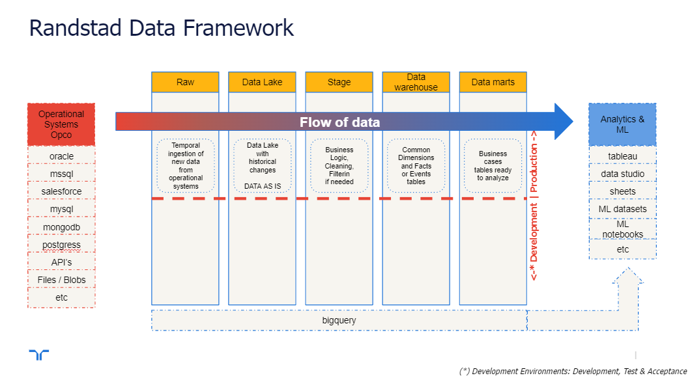
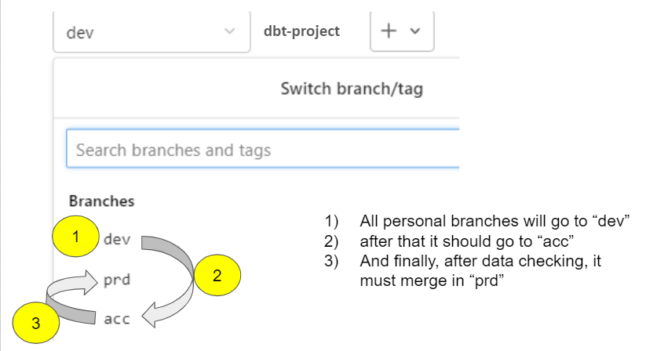

# DBT FOR ANALYTICAL ENGINEERING IN RANDSTAD

The Randstad DBT environment is the standard used to combine the ELT/ETL framework provided by the open-source DBT, the Randstad common framework for building data lakes, and the technology required to execute the data pipelines and SQL transformations in Bigquery in a constant CI/CD.

## Business challenges solved: ##
* Incredible cost reduction compared with other alternatives (Talent, Fusion, Alterix, Flycs, etc.)
* The documentation, training, and forums available by DBT make it very easy to get the knowledge to use the tool for all our current data/analyst engineers or advanced analyst accelerating the delivery of business value in the form of Data Products, datasets ready to be used by business users using their standard business intelligence tools (reports, sheets, dashboards, datasets for analytics and data science).
* Knowledge requirements:  
    * The unique condition to start working is to know SQL, the standard language for data professionals. No extra programming languages are required to start delivering data products.  
    * The DBT framework is mainly used for Bigquery in Randstad, but the knowledge acquired by our people can be applied to other databases (AlloyDB, Azure Synapse, Databricks, Dremio, Postgres, Redshift, Snowflake, Spark, Starburst & Trino).  
    * And the best multiplier, Business knowledge to accelerate value.  

## The main technological components are: ##
* Google Cloud (Bigquery, Cloud Run & Cloud Workflow/Scheduler)
* DBT (The ETL pipeline builder)
* Gitlab (Repositories and CI/CD processes)

---------------------

# DBT TRAINING

## DBT Basics

Learn how to transform raw data in business decisions with DBT.
* [DBT STANDARD TRAINING](randstad_documentation/basic_dbt_training.md)

## Starting with DBT ELT/ETL Tool in Randstad

Hand-on Set-up. Start delivering data pipelines in Randstad.
* [SETUP PERSONAL DEVELOPMENT ENVIRONMENT](randstad_documentation/randstad_dbt_setup_personal_environment.md)
* [SCHEDULING PIPELINES](randstad_documentation/randstad_dbt_schedulers.md)  

## Pipelines Flow: From "raw" to "data mart" (if needed)

## Gitlab Flow: From "dev" to "acc" to "prd"

## Technical architecture.

The components and the process
* [RANDSTAD ARCHITECTURE FOR DBT](randstad_documentation/randstad_gcp_dbt_architecture.md)

---------------------

# RANDSTAD DATALAKE FRAMEWORK

## The Randstad Framework for Data Analytics Processes

Moving the data from Operational Systems to Data Products ready to deliver Business Value. The 7 steps.
* [RANDSTAD FRAMEWORK FOR ELT](randstad_documentation/randstad_datalake_framework.md)  
