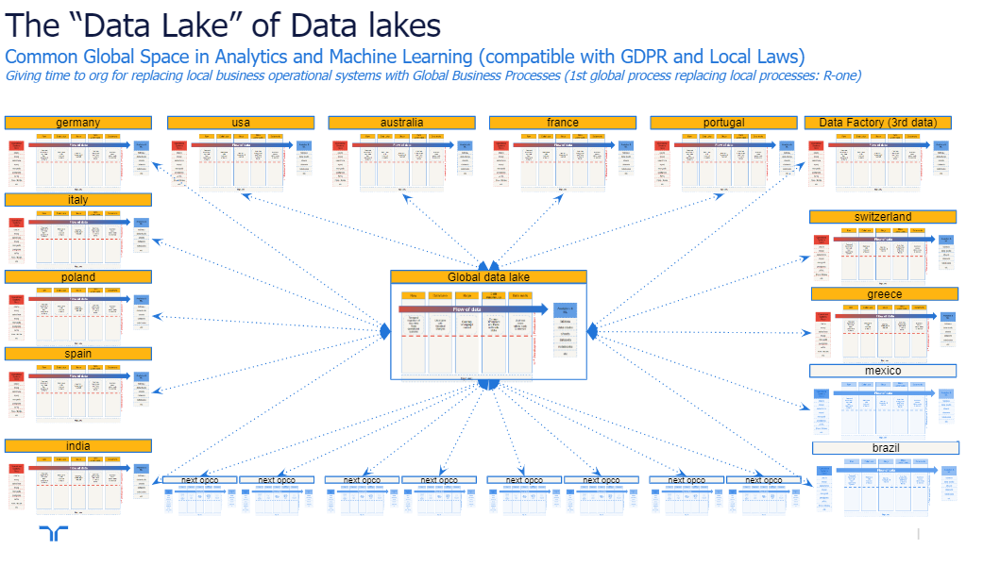

# RANDSTAD DATA OCEAN

## Pursuing the Randstad Data Ocean.

Digitalization is eating the world. Our data needs to be leveraged to allow us to understand our business, accelerate our decisions in front of market changes, and optimize and share globally as quickly as we can.
Randstad is accelerating the deployment of global processes. The first is the R-One project that will allow us to share globally in a common system all the processes and information related to our customers and talents. 

## Leveraging the Analytical Capabilities of all our Business Units (Opcos, Global Business).

But we can’t forget the __“Federation” nature of our Company__. Most of our most important data assets are still Opco-based, and hundreds of different systems still manage our day-to-day operations providing Opco with the information required to make decisions. Globalizing those systems will be challenging in the short term.

That is the main reason to work in a Global Data Ocean with common technology. Randstad needs to leverage our data. Scaling its applications in decision-making processes where descriptive, predictive, and causal analytics can improve our current capabilities. We need that Opcos can share the best practices using data. 

The first step it to start having a common technology for deploying all our operational data, a common technology to move and clean it, with the ambition to become analytical products (reports. dashboards, machine learning applications, predictive analytics, anomaly detection) with the mission to bring value to our business.

# RANDSTAD DATALAKE FRAMEWORK

Flexible enought to allow the simplest and the most difficult cases.

# RANDSTAD DATAOCEAN AMBITION

Sharing worldwide the best practices developed inside Opcos and Business Units. 

[Return to main](../README.md)