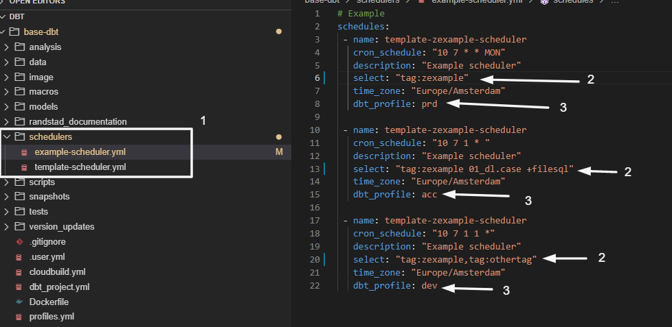

# SCHEDULING PIPELINES

You can scheduler the execution of the data pipelines using specific yaml files. As soon as you merge the changes in Gitlab, the system automatically creates, modify or delete the schedulers to be executed.  

. 

1. All the schedulers are located under the "schedulers" folder and you can create any number of yaml scheduler files.
2. the select tag accepts any dbt node selection. Any thing (xxxxx) that can be executed by the standard "dbt run -select xxxxxxx", can be used in the yaml file.
3. You can specify in what environment (dev, acc or prd) you require the scheduler. Normally the schedulers are only required in production (prd).
    * In acc and dev, you can execute different schedulers if required, but tipically they tend to be deleted after production is going fine.

[Return to main](../README.md)